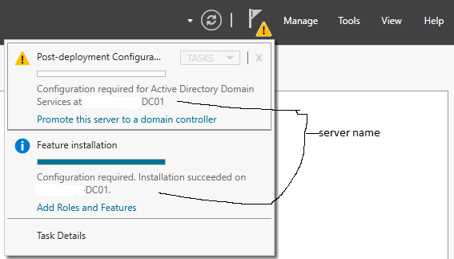
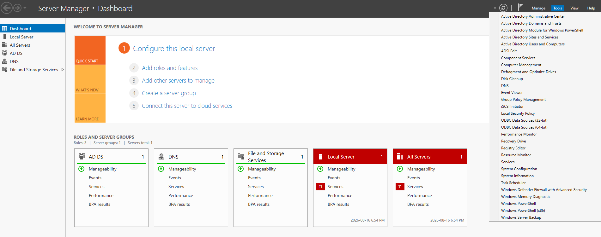

# Window-Server-Home-Lab
Active Directory DS deployment, Group Policy enforcement, and telemetry logging lab

## Environment & Tools Used
* **Operating Systems:** Windows Server 2025, Windows 10/11, Ubuntu Linux
* **Security Tools:** Microsoft Defender, Wireshark, Splunk / Wazuh SIEM
* **Networking & Protocols:** TCP/IP, DNS, DHCP, Active Directory Domain Services (AD DS)
* **Frameworks Aligned:** NIST CSF, CIA Triad

## Architecture & Lab Topology
# 🛡️ Active Directory & Windows Server Security Homelab

## 📌 Overview
This project documents the step-by-step deployment, configuration, and hardening of an enterprise **Active Directory Domain Services (AD DS)** environment. Built on Windows Server, this lab serves as the identity and access management (IAM) backbone for testing security policies, PowerShell automation, and centralized security monitoring.

---
## ⚙️ Phase 1: Network & Base Configuration

Before promoting the server to a Domain Controller, a static IP address and loopback DNS configuration were established to ensure reliable network and domain services resolution.<br />
(Using Class C IP's here for Samples, I am actually using class A IP's for massive space, short numbers that are easy to type and more freedom to segment[using subnets or Vlans])<br />

* **Static IP:** `192.168.1.10`
* **Subnet Mask:** `255.255.255.0`
* **Default Gateway:** `192.168.1.1`
* **Preferred DNS (Loopback):** `127.0.0.1`

### Configuration Evidence:




---

## 🏗️ Phase 2: Active Directory Domain Services (AD DS) & Domain Promotion

### 1. AD DS Role Installation
Installed the **Active Directory Domain Services** and **DNS Server** roles via Server Manager / PowerShell.

```powershell
# PowerShell deployment equivalent
Install-ADDSForest `
    -DomainName "lab.local" `
    -DomainNetbiosName "LAB" `
    -InstallDns:$true `
    -CreateDnsDelegation:$false `
    -DatabasePath "C:\Windows\NTDS" `
    -LogPath "C:\Windows\NTDS" `
    -SysvolPath "C:\Windows\SYSVOL" `
    -Force:$true
```
🔜 Upcoming Milestones & Roadmap
<details>
<summary>[x] Static IP and loopback DNS configuration
    <ul>
        <li>Add Roles and Features from Dashboard</li>
        <li>Install>Role-Based>Add Directory Domain Services, Add AD DS</li>
    </ul>
</summary></details>
<details>
<summary>[x] AD DS role installation and DC promotion
     <ul>
        <li>Install AD DS Role via Server Manager</li>
        <li>Promoted Server to a Domain Controller(DC)</li>
        <li>Creating a New Forest and the domain</li>
        <li>Verified the Domain Controller is functioning by checking AD Tools and testing DNS Resolution(cmd>NSLookup RootName)</li>
    </ul>
</summary>
</details>
<details>
<summary>[ ] Configure DNS forwarders (e.g., Cloudflare 1.1.1.1 / Google 8.8.8.8)
     <ul>
        <li></li>
        <li></li>
        <li></li>
    </ul></summary></details>
<details>
<summary>[ ] Tiered Organizational Unit (OU) design & IAM structure
    <ul>
        <li></li>
        <li></li>
        <li></li>
    </ul></summary></details>
<details>
<summary>[ ] PowerShell bulk user onboarding via CSV
     <ul>
        <li></li>
        <li></li>
        <li></li>
    </ul></summary></details>
<details>
<summary>[ ] Baseline Group Policy Object (GPO) security hardening
     <ul>
        <li></li>
        <li></li>
        <li></li>
    </ul></summary></details>
<details>
<summary>[ ] Sysmon and SIEM integration for security telemetry
     <ul>
        <li></li>
        <li></li>
        <li></li>
    </ul></summary></details>
    
# Install AD DS role and management tools
Install-WindowsFeature -Name AD-Domain-Services -IncludeManagementTools

## 📐 Architecture & Topology

```text
               +-------------------------------------------------+
               |             Internal Virtual Network            |
               +-------------------------------------------------+
                                        |
                 +----------------------+----------------------+
                 |                                             |
  +------------------------------+              +------------------------------+
  |  Windows Server 2025 DC      |              |  Windows 10/11 Workstation   |
  |  Hostname: DC-01             |              |  Hostname: WS-01             |
  |  IP: 192.168.1.10 /24        |              |  IP: DHCP (192.168.10.100+)  |
  |  Roles: AD DS, DNS, DHCP     |              |  Domain Joined               |
  +------------------------------+              +------------------------------+

```
<br>
## Frequently Asked Questions (FAQ)

### Key Concepts
<details>
<summary><b>Why promote a server to a Domain Controller?</b></summary>
<br>
<ul>
<li> Promoting a server to a Domain Controller is a pivotal step in establishing centralized network administration and security management. Key benefits include:</li>
<li> Centralized Identity & Access Management (IAM):** Transforms the server into the central authority for authenticating identities and managing access across the entire network.</li>
<li> Domain Creation & Security:** Creates a domain—a logical grouping of resources—providing a secure, unified environment to manage users, endpoints, and network assets.</li>
<li> Core Infrastructure Integration:** Establishes the necessary foundation for enterprise features, including **DNS integration**, **Group Policy Management (GPO)**, and **Active Directory Federation Services (AD FS)**.</li>
</ul>
---
</details><br>

## Screeshots


